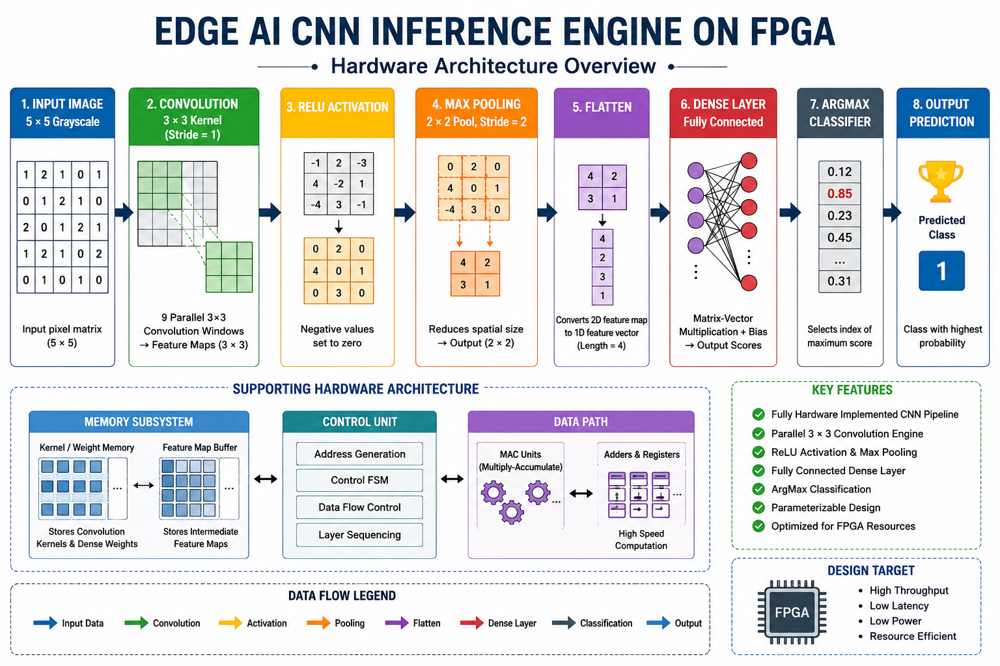

# 🚀 Edge AI CNN Inference Engine on FPGA


---

> Hardware implementation of a lightweight Convolutional Neural Network (CNN) inference engine using **Verilog HDL** and synthesized using **Xilinx Vivado 2026.1**.

---

# 🏗 CNN Hardware Architecture

<p align="center">

</p>

The architecture implements a complete CNN inference pipeline entirely in RTL hardware. Image data flows through convolution, activation, pooling, flattening, dense classification, and ArgMax prediction, demonstrating an FPGA-oriented Edge AI accelerator.

---

# 📖 Project Overview

This project presents the RTL implementation of a lightweight CNN inference engine designed for FPGA-based Edge AI applications.

Unlike software-based neural networks, every processing stage has been implemented as dedicated hardware modules in Verilog HDL, allowing the complete inference pipeline to be synthesized for FPGA deployment.

The project demonstrates modular RTL design, hardware acceleration concepts, memory-based parameter storage, and complete FPGA synthesis using Xilinx Vivado.

---

# ✨ Features

- ✅ 3×3 Convolution Engine
- ✅ MAC-Based Convolution
- ✅ Feature Map Generator
- ✅ ReLU Activation
- ✅ 2×2 Max Pooling
- ✅ Flatten Layer
- ✅ Fully Connected Dense Layer
- ✅ ArgMax Classifier
- ✅ Parameterized RTL Design
- ✅ Weight Memory
- ✅ Kernel Memory
- ✅ Multi-Kernel CNN Support
- ✅ Parallel Processing
- ✅ FPGA Ready RTL
- ✅ Vivado Synthesis

---

# ⚙ CNN Processing Pipeline

```
Input Image (5×5)

        │

        ▼

3×3 Convolution

        │

        ▼

Feature Maps

        │

        ▼

ReLU Activation

        │

        ▼

2×2 Max Pooling

        │

        ▼

Flatten Layer

        │

        ▼

Dense Layer

        │

        ▼

ArgMax

        │

        ▼

Predicted Class
```

---

# 📂 Project Structure

```
Edge-AI-CNN-Inference-Engine-on-FPGA

├── rtl/
├── testbench/
├── constraints/
├── memory/
├── docs/
│     └── images/
├── vivado/
├── README.md
└── LICENSE
```

---

# 📷 RTL Schematic

<p align="center">

</p>

The RTL schematic illustrates the hierarchical implementation of the CNN accelerator in hardware.

---

# 📷 Synthesized Schematic

<p align="center">

</p>

The synthesized netlist generated by Xilinx Vivado demonstrates successful hardware mapping of the RTL design.

---

# 📊 FPGA Resource Utilization

<p align="center">

</p>

The design occupies only a small percentage of available FPGA resources while maintaining a modular architecture.

---

# ⏱ Timing Report

<p align="center">

</p>

Timing analysis confirms successful synthesis. The design is fully synthesizable and ready for further FPGA implementation.

---

# 📈 Project Statistics

| Category | Details |
|-----------|----------|
| Language | Verilog HDL |
| Development Tool | Xilinx Vivado 2026.1 |
| Design Style | RTL |
| CNN Layers | Convolution → ReLU → Pool → Flatten → Dense → ArgMax |
| Memory Support | Weight Memory + Kernel Memory |
| FPGA Compatible | ✅ |
| Synthesis | ✅ Successful |
| GitHub | Public Repository |

---

# ✅ Verification Status

| Module | Status |
|----------|:------:|
| MAC Unit | ✅ |
| Conv3×3 | ✅ |
| Feature Map Generator | ✅ |
| ReLU | ✅ |
| Max Pooling | ✅ |
| Flatten | ✅ |
| Dense Layer | ✅ |
| ArgMax | ✅ |
| Integrated CNN | ✅ |
| RTL Simulation | ✅ |
| RTL Synthesis | ✅ |

---

# 🔮 Future Improvements

- Multi-channel RGB image support
- Multiple convolution layers
- Batch Normalization
- Softmax Layer
- AXI4 Interface
- BRAM Image Storage
- FPGA Board Deployment
- Real-Time Edge AI Applications

---

# 🛠 Tools & Technologies

- Verilog HDL
- Xilinx Vivado 2026.1
- FPGA RTL Design
- Digital Logic Design
- Git
- GitHub

---

# 👨‍💻 Author

**Abhay Nagure**

Electronics & Communication Engineering Student

Interested in:

- FPGA Design
- RTL Design
- Digital VLSI
- Embedded Systems
- Edge AI

---

# ⭐ If you found this project useful, consider giving it a star!

---

# 📄 License

This project is licensed under the MIT License.
